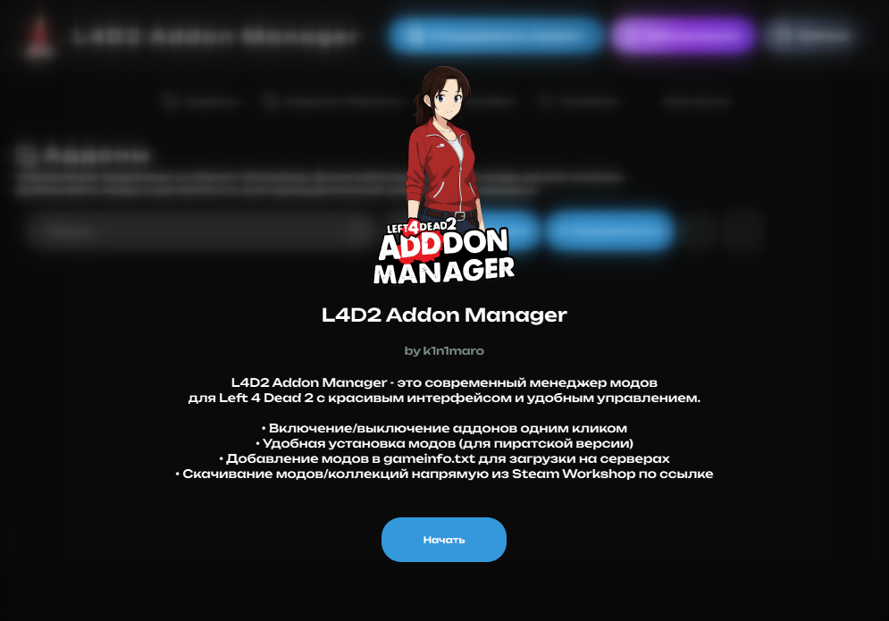
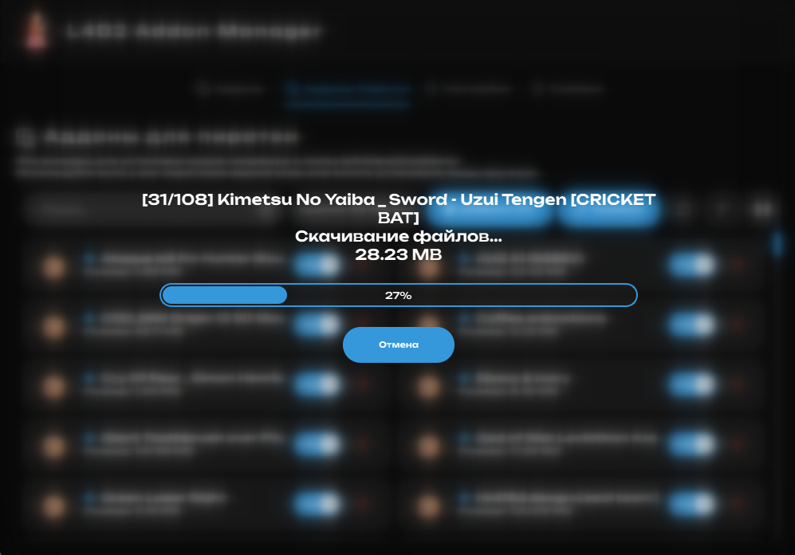
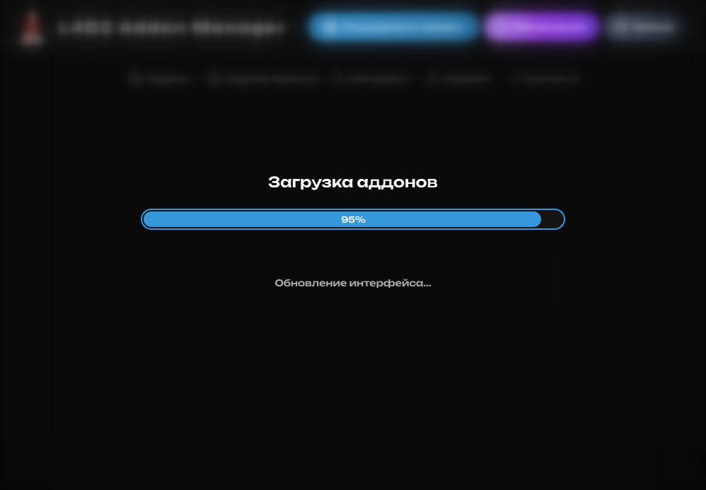
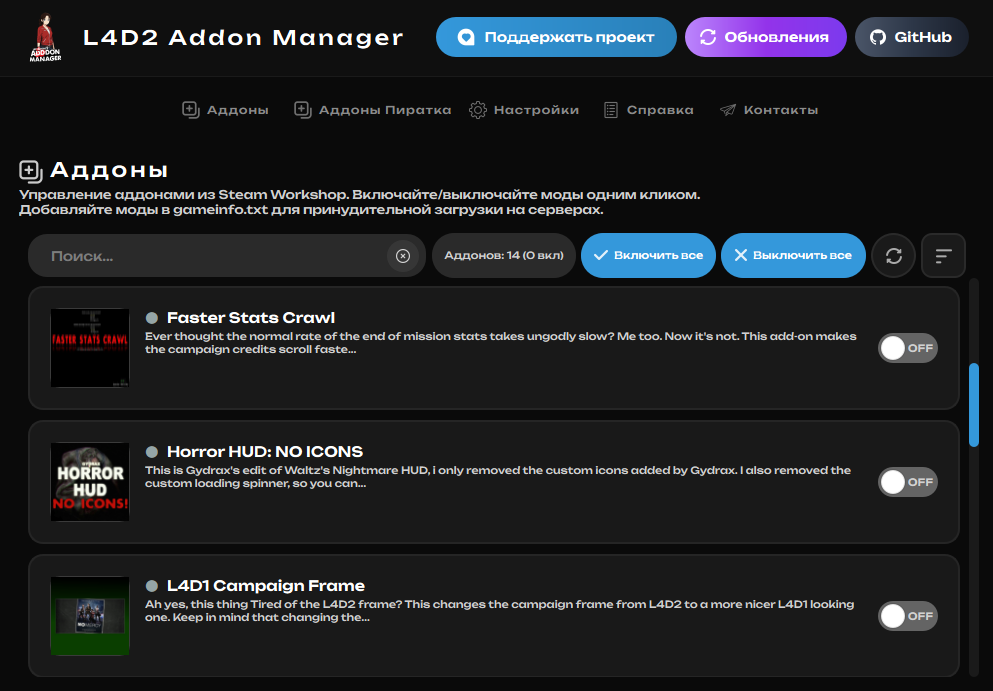
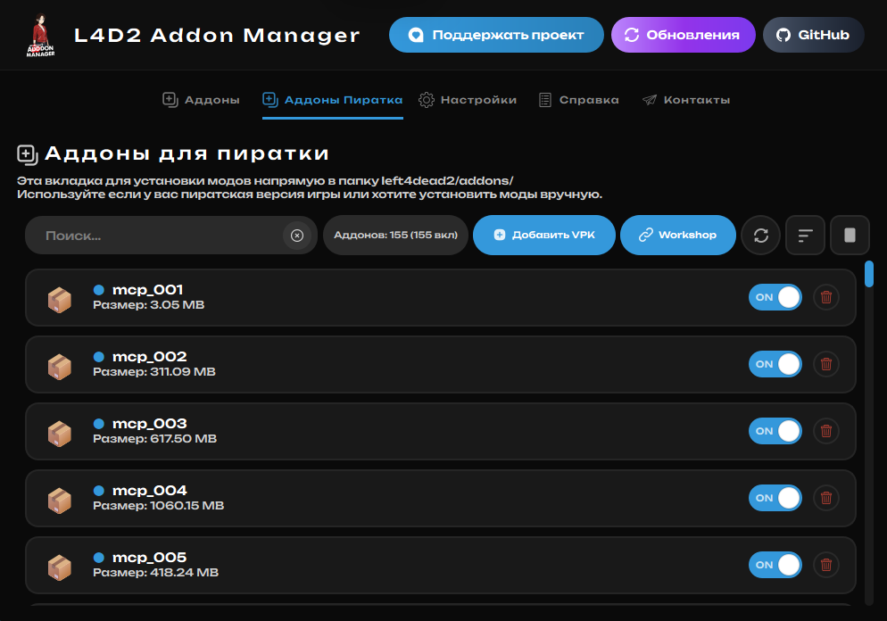
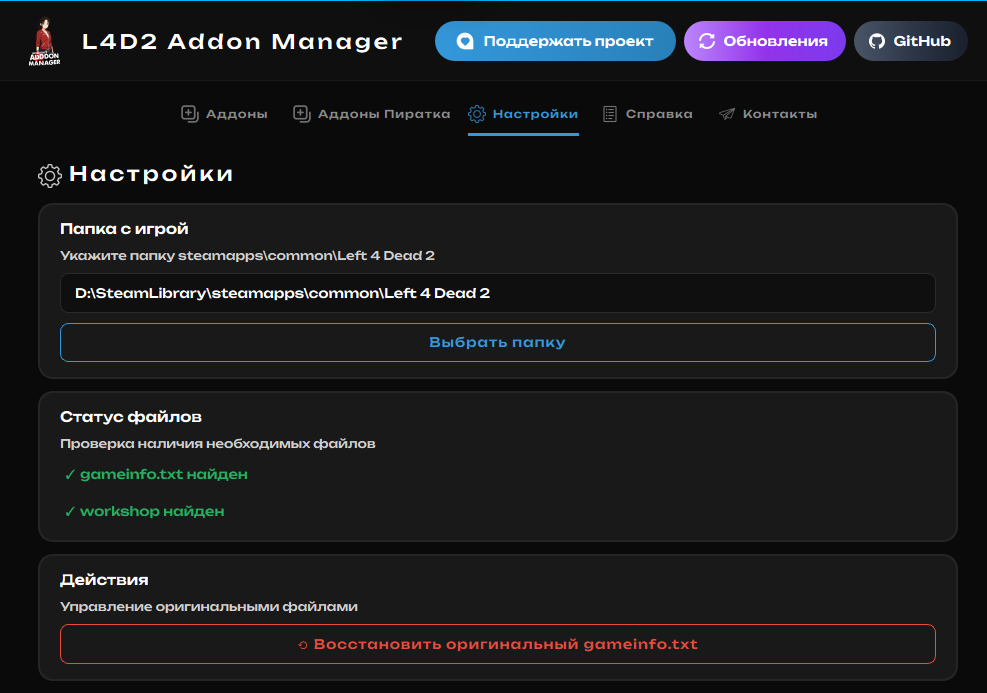
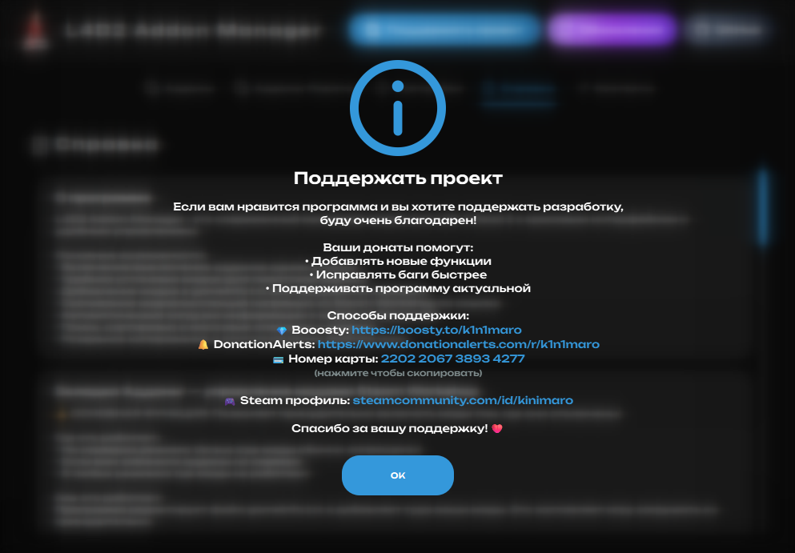

<div align="center">

# L4D2 Addon Manager


**Простой и удобный менеджер аддонов для Left 4 Dead 2**  
*Управляйте модами одним кликом без головной боли - поддержка Steam Workshop и пиратских версий игры*



</div>

## 🚀 Возможности

- **Принудительное включение модов** - На всех серверах! Мгновенное редактирование gameinfo
- **Удобнная устрановка из Workshop** - Устанавливай аддоны/целые коллекции просто вставив ссылку!
- **Управление одним кликом** - Включайте и выключайте моды мгновенно
- **Steam Workshop** - Полная поддержка официальных аддонов из мастерской
- **Пиратские версии** - Работает с любыми версиями игры L4D2
- **Автообновления** - Программа сама проверяет и устанавливает обновления

<details>
<summary>📸 <strong>Больше скриншотов</strong></summary>

<div align="center">

### Главное меню


### Настройки программы  


### Информация о модах


### Процесс сканирования


### Дополнительные функции


### Интерфейс в действии


</div>

</details>

<div align="center">

## 📥 Скачать EXE

[](https://github.com/k1n1maro/L4D2-Addon-Manager/releases/latest/download/L4D2_Addon_Manager_v1.1.0_Fixed.exe)

**Размер:** ~50MB | **Установка:** Не требуется

💡 Просто скачайте EXE файл и запустите - никаких дополнительных программ не нужно!

## 💝 Поддержать проект

[](https://boosty.to/k1n1maro)
[](https://www.donationalerts.com/r/k1n1maro)

**Карта Сбербанка:** `2202 2067 3893 4277`

</div>

<div align="center">

</div>

## 🧩 Технологии

- **Язык:** Python 3.8+
- **GUI Framework:** PyQt6
- **Сборка:** PyInstaller
- **Платформа:** Windows 10/11

## 📦 Установка

### Готовый EXE (рекомендуется)
```bash
# Скачайте EXE файл из релизов
# Запустите двойным кликом
# Укажите папку с игрой L4D2
```

### Из исходного кода
```bash
git clone https://github.com/k1n1maro/L4D2-Addon-Manager.git
cd L4D2-Addon-Manager
pip install -r requirements.txt
python l4d2_pyqt_main.py
```

<div align="center">


## 📝 История версий

| Версия | Дата | Описание |
|--------|------|----------|
| **v1.1.0** | 2024-12-13 | 🐛 Исправлены баги при первом запуске, улучшена стабильность |
| **v1.0.0** | 2024-12-10 | 🎉 Первый релиз с базовым функционалом |

</div>

<div align="center">

## 🐛 Нашли баг?

[](https://github.com/k1n1maro/L4D2-Addon-Manager/issues/new)

## 👨‍💻 Автор

**k1n1maro**  
[](https://github.com/k1n1maro)
[](https://steamcommunity.com/id/kinimaro/)

---

⭐ **Поставьте звезду, если проект понравился!**

*Сделано с ❤️ для сообщества Left 4 Dead 2*

</div>
